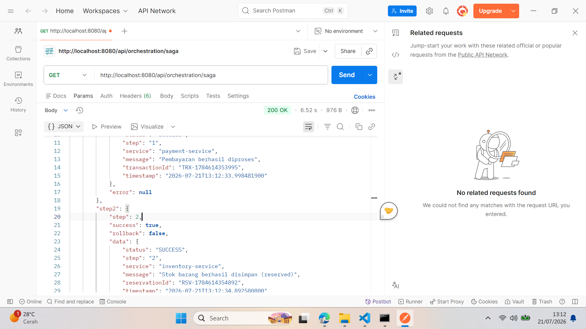

# ShopSaga — Saga Orchestration Pattern E-Commerce

Proyek ini mensimulasikan penerapan **Saga Orchestration Pattern** untuk menangani transaksi terdistribusi antar microservices pada platform e-commerce. Dilengkapi dengan frontend interaktif, autentikasi JWT, dan simulasi error untuk menguji mekanisme rollback.

---

## Daftar Isi

- [Tech Stack](#tech-stack)
- [Fitur](#fitur)
- [Arsitektur Saga Pattern](#arsitektur-saga-pattern)
- [Screenshot](#screenshot)
- [Prerequisites](#prerequisites)
- [Cara Install & Menjalankan](#cara-install--menjalankan)
- [Dokumentasi API](#dokumentasi-api)
- [Cara Penggunaan](#cara-penggunaan)
- [Skenario Testing Saga](#skenario-testing-saga)
- [Struktur Project](#struktur-project)

---

## Tech Stack

| Komponen | Teknologi |
|----------|-----------|
| **Bahasa** | Java 17 |
| **Framework** | Spring Boot 4.1.0, Spring Framework 7.x |
| **Build Tool** | Maven (via `mvnw` wrapper) |
| **Database** | PostgreSQL |
| **ORM** | Spring Data JPA / Hibernate |
| **Security** | Spring Security + JWT (jjwt 0.12.6) |
| **HTTP Client** | Spring WebFlux WebClient |
| **Frontend** | Vanilla HTML, CSS, JavaScript (Single Page Application) |
| **Server** | Embedded Tomcat |

---

## Fitur

### Frontend (SPA Interaktif)
- **Halaman Login/Register** — Autentikasi pengguna dengan JWT
- **Toko Produk** — Menampilkan 5 produk dengan harga, rating, dan tombol Add to Cart
- **Keranjang Belanja** — Drawer interaktif dengan kontrol quantity
- **Checkout** — Form pemesanan dengan simulasi error toggle
- **Visualisasi Saga** — Animasi real-time 3 step (Payment → Inventory → Shipping) dengan status: idle, loading, success, fail, rollback
- **Riwayat Transaksi** — Accordion detail per step dengan raw JSON response

### Backend (Saga Orchestration)
- **Orchestration Pattern** — 3 step berurutan dengan rollback otomatis
- **Simulasi Microservices** — Mock Payment, Inventory, Shipping service
- **Error Simulation** — Pemicu kegagalan di step mana pun untuk uji rollback
- **Autentikasi JWT** — Login/register dengan token-based auth
- **PostgreSQL** — Penyimpanan data pengguna

---

## Arsitektur Saga Pattern

### Alur Normal (Semua Sukses)

```
[Client] → POST /api/orchestration/saga
              │
              ▼
    ┌─────────────────┐
    │  Step 1: Payment │── POST /api/mock1 ──► SUCCESS
    └────────┬────────┘
             │ sukses
             ▼
    ┌─────────────────┐
    │ Step 2: Inventory│── POST /api/mock2 ──► SUCCESS
    └────────┬────────┘
             │ sukses
             ▼
    ┌─────────────────┐
    │ Step 3: Shipping │── POST /api/mock3 ──► SUCCESS
    └────────┬────────┘
             │ sukses
             ▼
       Status: "SUCCESS"
```

### Alur Gagal di Step 2 (Rollback Step 1)

```
[Client] → POST /api/orchestration/saga?failAt=step2
              │
              ▼
    ┌─────────────────┐
    │  Step 1: Payment │── POST /api/mock1 ──► SUCCESS
    └────────┬────────┘
             │ sukses
             ▼
    ┌─────────────────┐
    │ Step 2: Inventory│── POST /api/mock2/fail ──► FAILED
    └────────┬────────┘
             │ gagal → ROLLBACK
             ▼
    ┌─────────────────────────┐
    │ Rollback Step 1 (Refund)│── POST /api/mock1/rollback ──► SUCCESS
    └─────────────────────────┘

    Status: "FAILED" at "STEP2"
```

### Alur Gagal di Step 3 (Rollback Step 2 & 1)

```
[Client] → POST /api/orchestration/saga?failAt=step3
              │
              ▼
    ┌─────────────────┐
    │  Step 1: Payment │── POST /api/mock1 ──► SUCCESS
    └────────┬────────┘
             │ sukses
             ▼
    ┌─────────────────┐
    │ Step 2: Inventory│── POST /api/mock2 ──► SUCCESS
    └────────┬────────┘
             │ sukses
             ▼
    ┌─────────────────┐
    │ Step 3: Shipping │── POST /api/mock3/fail ──► FAILED
    └────────┬────────┘
             │ gagal → ROLLBACK (reverse order)
             ▼
    ┌─────────────────────────┐
    │ Rollback Step 2 (Stok)  │── POST /api/mock2/rollback ──► SUCCESS
    └────────┬────────┘
             ▼
    ┌─────────────────────────┐
    │ Rollback Step 1 (Refund)│── POST /api/mock1/rollback ──► SUCCESS
    └─────────────────────────┘

    Status: "FAILED" at "STEP3"
```

### Prinsip Rollback

- Kompensasi dijalankan dalam **urutan terbalik** dari step forward.
- Jika gagal di **Step 1**: Tidak ada rollback (belum ada yang sukses).
- Jika gagal di **Step 2**: Rollback Step 1 (refund payment).
- Jika gagal di **Step 3**: Rollback Step 2 (release inventory), lalu Rollback Step 1 (refund payment).

---

## Screenshot

### Halaman Login


> **Catatan:** Screenshot akan diperbarui sesuai tampilan terbaru.

---

## Prerequisites

1. **Java 17+** — [Download](https://adoptium.net/)
2. **Maven** (opsional, bisa pakai `mvnw`) — [Download](https://maven.apache.org/)
3. **PostgreSQL 14+** — [Download](https://www.postgresql.org/download/)
4. **Git** — [Download](https://git-scm.com/)

---

## Cara Install & Menjalankan

### 1. Clone Repository

```bash
git clone https://github.com/FGP27/MockService-kelompok6.git
cd MockService-kelompok6
```

### 2. Setup Database PostgreSQL

Buka **pgAdmin** atau **psql**, lalu buat database:

```sql
CREATE DATABASE trws_db;
```

Atau via terminal:

```bash
psql -U postgres -c "CREATE DATABASE trws_db"
```

### 3. Konfigurasi Aplikasi

File `src/main/resources/application.properties` sudah terkonfigurasi:

```properties
spring.datasource.url=jdbc:postgresql://localhost:5432/trws_db
spring.datasource.username=postgres
spring.datasource.password=Milliano2005
spring.jpa.hibernate.ddl-auto=update
```

Sesuaikan `username` dan `password` dengan PostgreSQL Anda.

### 4. Jalankan Aplikasi

```bash
mvnw spring-boot:run
```

Atau jika Maven sudah terinstall:

```bash
mvn spring-boot:run
```

Aplikasi akan berjalan di `http://localhost:8080`.

### 5. Akses Aplikasi

Buka browser: **http://localhost:8080**

**Akun Demo:**

| Email | Password | Role |
|-------|----------|------|
| `Admin@gmail.com` | `admin123` | ADMIN |
| `user@gmail.com` | `user123` | USER |

---

## Dokumentasi API

### Public Endpoints (Tanpa Autentikasi)

| Method | Endpoint | Deskripsi |
|--------|----------|-----------|
| `GET` | `/api/products` | Mendapatkan daftar semua produk |
| `GET` | `/api/products/{id}` | Mendapatkan detail produk by ID |
| `POST` | `/api/auth/register` | Registrasi pengguna baru |
| `POST` | `/api/auth/login` | Login dan mendapatkan JWT token |
| `GET` | `/index.html` | Halaman utama SPA |

### Mock Endpoints (Internal, Tanpa Autentikasi)

| Method | Endpoint | Deskripsi |
|--------|----------|-----------|
| `POST` | `/api/mock1` | Simulasi pembayaran sukses |
| `POST` | `/api/mock1/rollback` | Simulasi refund pembayaran |
| `POST` | `/api/mock1/fail` | Simulasi pembayaran gagal |
| `POST` | `/api/mock2` | Simulasi reservasi stok sukses |
| `POST` | `/api/mock2/rollback` | Simulasi release stok |
| `POST` | `/api/mock2/fail` | Simulasi reservasi stok gagal |
| `POST` | `/api/mock3` | Simulasi pengiriman sukses |
| `POST` | `/api/mock3/rollback` | Simulasi pembatalan pengiriman |
| `POST` | `/api/mock3/fail` | Simulasi pengiriman gagal |

### Saga Endpoints (Memerlukan Autentikasi)

| Method | Endpoint | Deskripsi |
|--------|----------|-----------|
| `POST` | `/api/orchestration/saga` | Eksekusi saga penuh |
| `GET` | `/api/orchestration/saga` | Eksekusi saga dengan dummy order |
| `GET` | `/api/orchestration/step1` | Eksekusi hanya step 1 |
| `GET` | `/api/orchestration/step2` | Eksekusi hanya step 2 |
| `GET` | `/api/orchestration/step3` | Eksekusi hanya step 3 |

**Parameter Query Opsional:**

| Parameter | Tipe | Deskripsi |
|-----------|------|-----------|
| `failAt` | String | `step1`, `step2`, atau `step3` — mensimulasikan kegagalan di step tersebut |

**Contoh Request:**

```bash
curl -X POST http://localhost:8080/api/orchestration/saga \
  -H "Content-Type: application/json" \
  -H "Authorization: Bearer <token>" \
  -d '{
    "product": "Sepatu Running",
    "quantity": 2,
    "price": 150000,
    "customerName": "Budi",
    "address": "Jakarta",
    "paymentMethod": "Bank BCA"
  }'
```

---

## Cara Penggunaan

### 1. Login
- Buka `http://localhost:8080`
- Masukkan email dan password (atau register akun baru)
- Klik **Login**

### 2. Belanja
- Browse produk-produk yang tersedia
- Klik **Add to Cart** pada produk yang diinginkan
- Klik ikon 🛒 di navbar untuk membuka keranjang

### 3. Checkout
- Klik **Proceed to Checkout**
- Isi data pengiriman (nama, email, telepon, alamat, metode bayar)
- Pilih **Simulasi Error** (None untuk sukses, Step 1/2/3 untuk simulasi gagal)
- Klik **Place Order**

### 4. Lihat Hasil
- Tampilan **Processing** akan memvisualisasikan setiap step secara real-time
- Step berhasil: 🟢 hijau, gagal: 🔴 merah, rollback: 🟡 kuning
- Halaman **Result** menampilkan detail order dan riwayat transaksi
- Klik setiap riwayat untuk melihat raw JSON response

---

## Skenario Testing Saga

### Skenario 1: Semua Sukses
1. Pilih **None** pada error simulation
2. Klik **Place Order**
3. Semua step berwarna hijau ✅
4. Status: **SUCCESS**

### Skenario 2: Gagal di Payment (Step 1)
1. Pilih **Step 1** pada error simulation
2. Klik **Place Order**
3. Step 1 merah ❌, step 2 & 3 tidak dijalankan
4. Tidak ada rollback
5. Status: **FAILED at STEP1**

### Skenario 3: Gagal di Inventory (Step 2)
1. Pilih **Step 2** pada error simulation
2. Klik **Place Order**
3. Step 1 hijau ✅, Step 2 merah ❌, rollback Step 1 🟡
4. Status: **FAILED at STEP2**

### Skenario 4: Gagal di Shipping (Step 3)
1. Pilih **Step 3** pada error simulation
2. Klik **Place Order**
3. Step 1 & 2 hijau ✅, Step 3 merah ❌, rollback Step 2 & 1 🟡
4. Status: **FAILED at STEP3**

---

## Struktur Project

```
demo/
├── pom.xml                          # Konfigurasi Maven & dependencies
├── mvnw / mvnw.cmd                  # Maven Wrapper
├── README.md                        # Dokumentasi ini
├── documentation/                   # Screenshot & dokumentasi tambahan
└── src/
    └── main/
        ├── java/com/example/demo/
        │   ├── DemoApplication.java           # Entry point
        │   ├── auth/
        │   │   ├── AuthController.java        # Login & register endpoints
        │   │   ├── AuthResponse.java          # Response DTO
        │   │   ├── LoginRequest.java          # Login request DTO
        │   │   └── RegisterRequest.java       # Register request DTO
        │   ├── config/
        │   │   ├── DataInitializer.java       # Seed data pengguna demo
        │   │   └── WebClientConfig.java       # WebClient bean (baseUrl)
        │   ├── controller/
        │   │   ├── MockController.java        # Simulasi 3 microservices
        │   │   ├── OrchestrationController.java # Endpoint saga
        │   │   └── ProductController.java     # Endpoint produk
        │   ├── dto/
        │   │   ├── OrderRequest.java          # Request order
        │   │   ├── ProductDto.java            # Data produk
        │   │   ├── SagaResponseDto.java       # Response saga
        │   │   └── StepResultDto.java         # Hasil per step
        │   ├── model/
        │   │   └── User.java                  # Entity pengguna (UserDetails)
        │   ├── repository/
        │   │   └── UserRepository.java        # JPA repository
        │   ├── security/
        │   │   ├── CustomUserDetailsService.java # Load user dari DB
        │   │   ├── JwtAuthFilter.java         # Filter JWT per request
        │   │   ├── JwtUtil.java               # Generate & validasi JWT
        │   │   └── SecurityConfig.java        # Konfigurasi Spring Security
        │   └── service/
        │       ├── OrchestrationService.java  # Core saga orchestrator
        │       └── orchestrationstep/
        │           ├── Step1Service.java      # Payment service
        │           ├── Step2Service.java      # Inventory service
        │           └── Step3Service.java      # Shipping service
        └── resources/
            ├── application.properties         # Konfigurasi aplikasi
            └── static/
                └── index.html                 # Frontend SPA (1468 baris)
```
